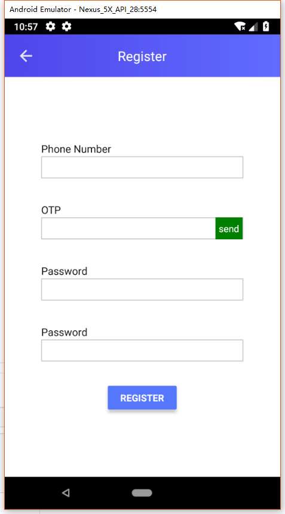

# react-native-navigationBar
用于ReactNative的标题栏NavigationBar组件 <br/>

博客地址：https://blog.csdn.net/u011272795/article/details/80722036



用到一个屏幕适配工具类，使用方法和代码 [请点这里](https://blog.csdn.net/u011272795/article/details/73824558)

#### 属性：
| Prop | Type | Default | Description
| ---------- | :-----------:         |:---------------:| -----------|
| style      | ViewPropTypes.style | -               |标题栏的样式 |
| showBackgroundIMG      | bool | true               |背景为一个图片 |
| title      | string              | -               |标题使用的字符串 |
| titleLayoutStyle  | ViewPropTypes.style   | -               |标题文字的样式
| titleView  | PropTypes.element   | -               |替换标题文字的组件
| leftButton  | PropTypes.element   | -              |自定义左侧按钮
| leftText  | string   | ''               |左侧返回按钮的文字
| leftTextStyle  | ViewPropTypes.style   | -               |替换标题文字的组件
| showleftImg  | bool   | true             |是否显示标题的后退按钮，本组件使用的是react-native-vector-icons中的图标，可自行替换成其他Image
| showLeft  | bool   | true             | 是否显示返回按钮
| onLeftClick  | func   | this.props.navigation.goBack()            | 左侧按钮的点击事件(默认为ReactNavigation的goback)
| showRight  | bool   | false             | 是否显示右侧按钮
| rightText  | string   |    更多           | 右侧按钮的文字
| rightTextStyle  | ViewPropTypes.style    | -             | 是否显示返回按钮
| rightButton  | PropTypes.element   | -             | 自定义右侧按钮
| rightButton  | PropTypes.element   | -             | 右侧按钮的点击事件
| statusBar  | {  barStyle: PropTypes.oneOf(['light-content', 'default', 'dark-content']),  hidden: PropTypes.bool,  backgroundColor: PropTypes.string,}   | { barStyle: 'default', hidden: false,}             | 自定义状态栏


### 在页面使用：
#### 常规页面插入
```
    render() {
        return (
            <View style={{flex: 1}}>
                {this._renderNav()}
                ...
            </View>
        )
    }

    _renderNav() {
        return (
            <NavigationBar
                    title={'Main'}
                    //showLeft={false}
                    onLeftClick={()=>{
                                   alert('a')
                               }}
                    leftButton={()=><View><Text>自定义左侧按钮</Text></View>}
                    statusBar={{
                        barStyle: 'dark-content',
                        backgroundColor: 'white',
                        hidden: false,//true则隐藏
                    }}
                   
                />
        )
    }
```
#### 配合ReactNavigation使用
```
const RootStack = createStackNavigator({
    TaskList: {screen: TaskListPage},
    TaskDetails: {screen: TaskDetailsPage}
}, {
    navigationOptions: ({navigation}) => ({
        header: <NavigationBar title={navigation.state.routeName}
                               showLeft={navigation.state.routeName !== 'TaskList'}
                               navigation={navigation}
        />
    })
});
```


